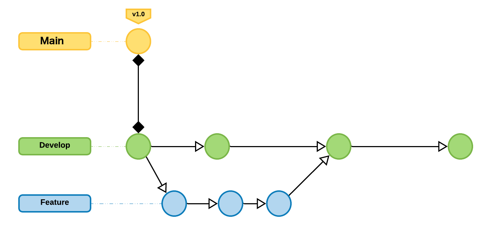

## ~~Sharing~~ Working with Others

When you work in a repository by yourself, you get to apply the way you like to work to the repository. Whether it is the branching strategy (if you even use one), commit message standards, code review requirements, and so much more, you are in control of every aspect of the repository. Once you start adding colleagues into a repository the way _you_ work might not scale. There might be duplicated work efforts on tasks, people might not know who to ask for a pull request review from (or that they should even be asking for a review), and other collisions of efforts that make you wish you were just working solo again.

### Collaboration tools

GitHub was built to be a social coding platform and as such, has a selection of tools that makes it easier for you to work with other people in the same repository.

#### Branching strategy

Before you begin flipping switches and adjusting dials, it is important to land on a branching strategy that meets your needs. Typically git-based projects base their branching strategy on the [GitHub Flow](https://guides.github.com/introduction/flow/) or [Git Flow](https://nvie.com/posts/a-successful-git-branching-model/) and make adjustments to those flows to fit their needs.

Outside of the simplest branching strategy, the GitHub Flow, a lot of people use a strategy that looks like this:

In this workflow, contributors create branches off of the `dev` branch, called `feature` branches. The changes on this `feature` branch are merged into the `dev` branch and after a collection of changes (from other `feature` branches) have been made to the `dev` branch it is merged into the `main` branch. The merging of the `dev` branch into the `main` branch might coincide with a new release or major update to the project.

#### GitHub Issues

Repositories on GitHub provide a space to collect work items within objects called, "Issues". These issues can be used to organize the work that needs to be done to make your project better. A typical issue might include things like bugs found or feature requests.

You can further organize these work items using [GitHub Projects](https://docs.github.com/en/github/managing-your-work-on-github/about-project-boards) or [Milestones](https://docs.github.com/en/github/managing-your-work-on-github/about-milestones).

#### Pull Requests

After a collaborator has decided on what issue they want to tackle, they create some commits on their branch and share those changes via the pull request. While the pull request isn't a new tool when collaborating in a repository their are additional features that can be used to make your pull request process more streamlined.

##### CODEOWNERS

Don't leave your collaborators wondering _who_ should be reviewing their pull request. Create a `CODEOWNERS` file in your repository and automatically assign reviewers to pull requests based on the files or folders that have been modified in the repository.

For more information about CODEOWNERS, here are some links:

- [About CODEOWNERS](https://docs.github.com/en/github/creating-cloning-and-archiving-repositories/about-code-owners)
- [Code review assignments](https://docs.github.com/en/organizations/organizing-members-into-teams/managing-code-review-assignment-for-your-team)
- [Require CODEOWNERS review in pull requests](https://docs.github.com/en/github/administering-a-repository/about-protected-branches#require-pull-request-reviews-before-merging)

##### Status checks

You can connect the various tests that you run against changes to your repository to your pull requests to automatically run as changes are made and share the results from those tests right in the pull request.

Additionally, through the use of protected branches, you can require that the tests that are run on the pull request must pass before the pull request can be merged.

For more information about status checks, check out these links:

- [About status checks](https://docs.github.com/en/github/collaborating-with-issues-and-pull-requests/about-status-checks)
- [Requiring status checks with protected branches](https://docs.github.com/en/github/administering-a-repository/about-protected-branches#require-status-checks-before-merging)